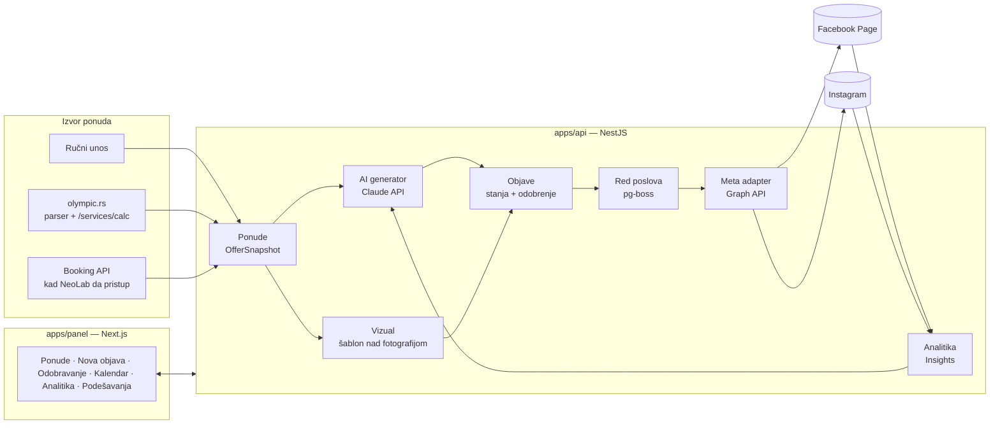
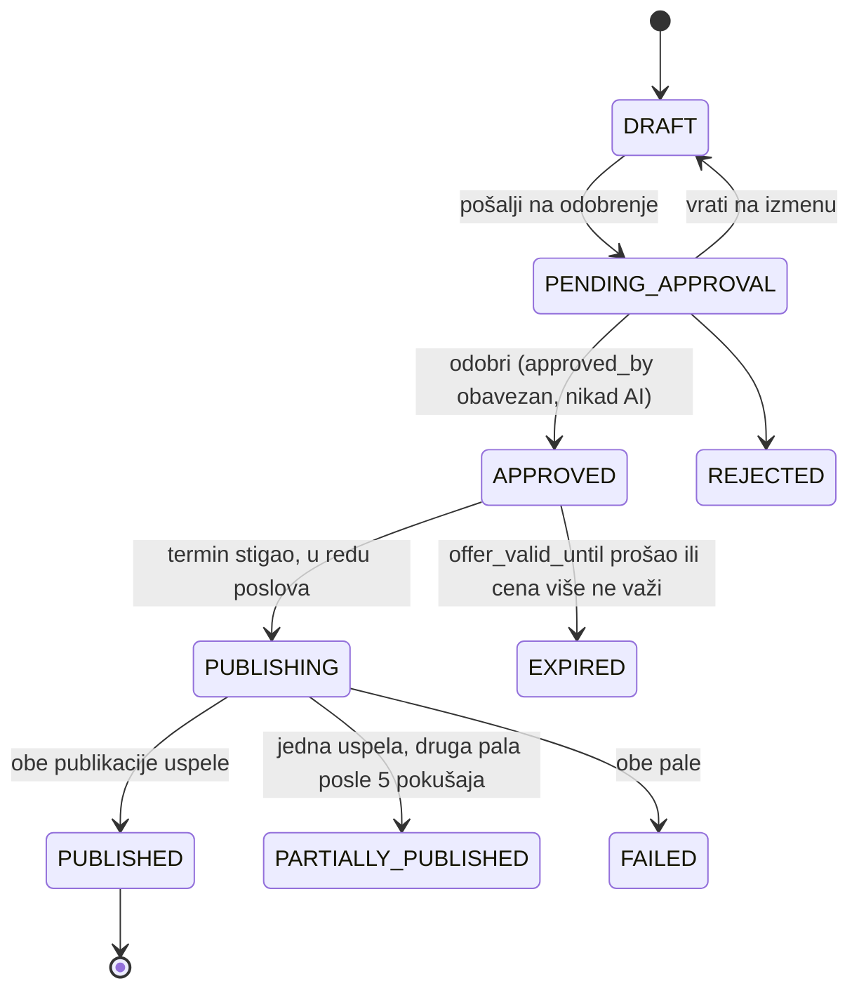

# Olympic Travel — Meta objave: predlog arhitekture aplikacije

2026-09-22 · Nivo: arhitektonski predlog, dovoljan da se po njemu piše specifikacija po modulima i kod.
Dopunjuje dokument „Olympic Travel — aplikacija za automatizaciju objava" (cilj, obim, faze) — ovde je **kako se gradi**, tamo je **šta se gradi i zašto**.

---

## 0. Šta je istraženo i šta iz toga sledi

### 0.1 Terminal Travel (D:\Terminal Travel) — šta se preuzima

Terminal (TT) već ima modul **M12 Marketing** koji rešava 70 % istog problema: `ContentPiece` sa stanjima `DRAFT → PENDING_APPROVAL → APPROVED → PUBLISHED / EXPIRED`, AI nacrt, ljudsko odobrenje kao nepovratna granica, cron koji svaki minut objavljuje dospeli sadržaj, `DistributionChannelAdapter` interfejs sa `FACEBOOK`/`INSTAGRAM` adapterima (trenutno **mock** — ne gađaju Graph API), `ChannelConfig` sa enkriptovanim kredencijalima, `ContentMedia` galerija, `tracking_code` za atribuciju rezervacija, YUTA pravilo za označavanje AI vizuala.

Pregledan kod (pročitan, ne pretpostavljen):

| TT fajl | Šta radi | Za Olympic |
| --- | --- | --- |
| `m12-marketing/distribution/distribution-channel-adapter.interface.ts` | `publish(content) → {externalPostId, publishedAt}`, `unpublish()` | preuzeti interfejs doslovno, proširiti sa `fetchInsights()` |
| `distribution/adapters/social-mock.adapter.ts` | mock FB/IG | zameniti pravim `MetaGraphAdapter` |
| `content/content-publish-scheduler.service.ts` | `@Cron(EVERY_MINUTE)` → `publishDueContent()` | preuzeti obrazac; dodati red poslova sa ponovnim pokušajima (TT ga nema) |
| `content/ai-draft-generator.ts` | deterministički šablon, bez LLM-a; datum roka **kao datum, ne „još 7 dana"** | preuzeti pravilo o datumu; sam generator zameniti Claude pozivom |
| `content/ai-transparency-check.ts` | regex provera oznake za AI vizual pri odobrenju | preuzeti doslovno |
| `content/content-media-storage.ts` | lokalni disk, bela lista `image/*`, `video/*` | preuzeti; dodati **javni URL** (Instagram zahtev) |
| `content/tracking-code.ts` | 8-znakovni kod bez O/0/I/1 | preuzeti doslovno |
| `channels/channels.service.ts` + `common/crypto/secret-box` | tokeni enkriptovani, nikad se ne vraćaju iz API-ja | preuzeti doslovno |
| `m15-ai-orkestracija/anthropic/anthropic-client.service.ts` | jedan Anthropic klijent, mesečni budžet u bazi, tvrda brava | preuzeti obrazac (uprošćeno) |
| `apps/panel/src/lib/api-client.ts`, `session.ts` | panel bez baze, server-side poziva API, refresh tokena single-flight | preuzeti obrazac |
| TT `CLAUDE.md`, `docs/analize/33-ZAMKE-I-OBAVEZNE-PROVERE.md` | pravila rada za AI agente | preuzeti pravila (skraćeno) — isti tim, iste zamke |

Stek TT-a (`docs/00-MASTER-ARHITEKTURA.md` §6): TypeScript svuda, NestJS + Prisma + PostgreSQL, Next.js panel sa shadcn/Radix + Tailwind, `@nestjs/schedule`, `nodemailer`, `helmet`, Anthropic SDK. Testovi: jest, 1141 backend + 13 panel.

**Šta TT nema, a Olympic-u treba:** pravi Meta Graph adapter, upravljanje istekom tokena, red poslova sa ponovnim pokušajima, generisanje vizuala (cena + logo preko fotografije), javni URL za slike, Insights (analitika po objavi), varijante teksta po mreži (TT ima jedan `body` po jeziku), izvor ponuda sa spoljnog sajta.

### 0.2 olympic.rs — šta je otkriveno (provereno 22.9.2026 `curl`-om, ne pretpostavljeno)

- WordPress + **custom tema NeoLab** (`wp-content/themes/theme`, `neolab.hr`), Yoast SEO, WSpay plaćanje. WP REST (`/wp-json/wp/v2/`) postoji, ali ponude/hoteli **nisu** WP sadržaj — WP ima samo statične stranice.
- Ponude se renderuju server-side iz booking sistema kroz temu. Tema ima **sopstvene JSON servise** na istom domenu: `/services/calc/`, `/services/get_pricelists/`, `/services/get_departures/`, `/services/list/`, `/services/search_offer/`, `/services/booking_form/`, `/services/pdf/`…
  - `/services/calc/?unitId=72077&guests=2&dateFrom=…&dateTo=…&objectGroupId=1&language=sr` → JSON sa `booking.status`, `calc.total`, `nights`, `currencySymbol`, `isAvailable` — **živa cena i raspoloživost** za konkretnu jedinicu i termin.
  - `/services/list/` vraća **HTML**, ne JSON (nije upotrebljiv kao izvor podataka).
- Stranica hotela (npr. `/letovanje/grcka/hanioti/hotel-dionysos/103208/`) u HTML-u nosi strukturirane podatke po sobi: `data-unitId`, `data-prices` (JSON: `price`, `priceOld`, `paymentKey` „po osobi po danu", `specialDiscount`), `data-pricelistId` + `data-pricelistsService` („Noćenje i doručak"), galerija slika (`data-images-gallery-unit-…`) sa CDN-a `mcdn.pro`.
- Identifikatori: `objectId` (hotel, npr. 103208), `unitId` (soba), `pricelistId` (usluga), `objectGroupId=1` (smeštaj), `countryId`, `placeId`.
- Booking sistem iza toga nije javno imenovan (slike na `mcdn.pro`, ID-evi kao gore); dokumentaciju ima NeoLab.

**Posledica za arhitekturu:** faza 3 (povezivanje sa ponudama) **ne mora da čeka NeoLab** — stranica hotela + `/services/calc/` daju naziv, sobu, uslugu, cenu „od", staru cenu, popust, fotografije i proveru raspoloživosti. Direktan API booking sistema ostaje poželjan (stabilniji od parsiranja HTML-a), ali nije blokada.

---

## 1. Odluka o obliku aplikacije

**Preporuka: samostalna aplikacija, isti stek i ista struktura kao Terminal Travel** (NestJS API + Next.js panel + PostgreSQL + Prisma), u sopstvenom repozitorijumu, sa oko 40 % koda preuzetog iz TT M12/M15/M17.

Zašto ne jedna Next.js aplikacija sa Prismom (tehnički bi bila dovoljna za ovaj obim):

1. Preuzimanje koda iz TT je doslovno samo ako je stek isti — adapter interfejs, scheduler, enkripcija tajni, audit log, sesija panela.
2. AI agenti koji rade na oba projekta rade po istim pravilima i istim zamkama; nema učenja druge konvencije.
3. Objavljivač i AI generator su pozadinski procesi (cron, red poslova, dugi pozivi ka Meti) — u NestJS-u su prirodni; u Next.js-u su naknadno dodat teret.
4. Ako Olympic sutra doda drugi kanal (TikTok, newsletter) ili drugi ulaz (subagenti), API već postoji.

Cena: dva procesa umesto jednog (API na :3000, panel na :3100) — na istom serveru, isti `docker compose`. Prihvatljivo.

Zašto ne ugraditi u sam TT kao modul: druga firma, drugi podaci, drugi Meta nalog, drugi server. Deljenje se radi kopiranjem koda, ne deljenjem baze.

---

## 2. Arhitektura — slojevi



Granice: panel nema bazu ni poslovnu logiku (TT M17 obrazac). Sva pravila (ko sme da odobri, da li je cena sveža, da li je token istekao) žive u API-ju. Meta se dodiruje **isključivo** iz `MetaGraphAdapter` — nijedan drugi fajl ne zna URL Graph API-ja.

---

## 3. Model podataka (Prisma)

Nazivi polja u `snake_case` u bazi, `camelCase` u kodu (TT obrazac).

### 3.1 Ponude

| Entitet | Ključna polja | Napomena |
| --- | --- | --- |
| `Offer` | `id`, `source` (`MANUAL` / `SITE` / `BOOKING_API`), `external_object_id`, `external_unit_id`, `external_pricelist_id`, `hotel_name`, `destination`, `country`, `service` („Noćenje i doručak"), `date_from`, `date_to`, `price_amount`, `price_currency`, `price_unit` („po osobi po danu"), `price_old`, `discount_label`, `booking_url`, `fetched_at`, `is_stale` | Jedna ponuda = jedan hotel + soba + usluga + termin. `booking_url` se gradi iz ID-eva (`?objectGroupId=…&unitId=…&pricelistId=…&dateFrom=…`). |
| `OfferImage` | `offer_id`, `source_url` (mcdn.pro ili upload), `local_path`, `width`, `height`, `is_primary` | Slike se **kopiraju** lokalno pri uvozu — CDN URL može nestati, a vizual mora biti reproducibilan. |
| `OfferFetchLog` | `offer_id`, `fetched_at`, `ok`, `diff` (JSON) | Šta se promenilo od prošlog povlačenja (cena, raspoloživost). Osnova za predloge „snižena cena". |

### 3.2 Objave

| Entitet | Ključna polja | Napomena |
| --- | --- | --- |
| `Post` | `id`, `offer_id` (nullable — sezonske objave bez hotela), `occasion` (`NEW_OFFER`, `LAST_MINUTE`, `DISCOUNT`, `SEASONAL`, `FIRST_PAYMENT_DEADLINE`, `WEEKLY_PICK`), `status`, `generated_by` (`AI`/`HUMAN`), `created_by`, `approved_by`, `approved_at`, `scheduled_at`, `offer_valid_until`, `tracking_code`, `contains_ai_generated_media`, `price_snapshot` (JSON: cena/termin/valuta kako su bili u trenutku odobrenja) | `price_snapshot` je dokaz šta je odobreno. TT `ContentPiece` + `offer_booking_to` + `source_offer_id`. |
| `PostVariant` | `post_id`, `channel` (`FACEBOOK`/`INSTAGRAM`), `body`, `hashtags[]`, `link_url`, `is_selected`, `ai_alternatives` (JSON — tri predloga) | TT ima jedan `body` po jeziku; Olympic-u treba jedan po mreži (FB duži + link, IG kraći bez linka). |
| `PostMedia` | `post_id`, `kind` (`TEMPLATE_RENDER`/`UPLOAD`/`AI_GENERATED`), `local_path`, `public_url`, `mime`, `width`, `height`, `template_id`, `render_params` (JSON) | `public_url` **obavezan** pre objave na IG (Graph API preuzima sliku sa javnog URL-a, samo JPEG). |
| `PostPublication` | `post_id`, `channel`, `external_post_id`, `permalink`, `published_at`, `attempts`, `last_error`, `status` (`QUEUED`/`PUBLISHING`/`PUBLISHED`/`FAILED`) | Jedna objava → dve publikacije. FB može uspeti a IG pasti; svaka se prati zasebno. |
| `PostMetrics` | `publication_id`, `captured_at`, `reach`, `impressions`, `engagement`, `link_clicks`, `likes`, `comments`, `shares`, `saves` | Snimci na 48 h i 7 dana; više redova po publikaciji. |

Stanja `Post.status` (TT + dva nova):



Nepovratna granica (TT §3): posle `APPROVED` tekst i mediji se ne menjaju. Izmena = novi `Post` (kopija), stari u `REJECTED`.

### 3.3 Kanali, stil, korisnici

| Entitet | Ključna polja | Napomena |
| --- | --- | --- |
| `ChannelAccount` | `channel`, `external_account_id` (page id / ig user id), `display_name`, `auth_config_encrypted` (page token, user token, app id), `token_expires_at`, `status` (`ACTIVE`/`TOKEN_EXPIRING`/`TOKEN_EXPIRED`/`INACTIVE`), `last_checked_at` | TT `ChannelConfig` + istek tokena. |
| `StyleExample` | `channel`, `occasion`, `body`, `source` (`IMPORTED`/`FROM_PUBLISHED`), `score` (iz metrika), `is_active` | Biblioteka 20–30 uspešnih objava; puni se ručno na startu, kasnije automatski iz `PostMetrics`. |
| `PromptTemplate` | `occasion`, `channel`, `system_prompt`, `version`, `is_active` | Verzionisano; promena šablona ne menja postojeće objave. |
| `VisualTemplate` | `name`, `layout` (JSON: pozicije cene, loga, teksta), `logo_path`, `font`, `colors` | 2–3 fiksna dizajna (1080×1080 IG feed, 1080×1350 portret, 1200×630 FB). |
| `RecurringPlan` | `name`, `cron` („0 8 * * 1"), `occasion`, `selection_rule` (JSON: npr. „najveći popust u poslednjih 7 dana"), `channel[]`, `is_active` | „Ponuda nedelje" ponedeljkom, vikend petkom — aplikacija ujutru pripremi predlog. |
| `User`, `Role` (`OPERATOR`/`APPROVER`/`ADMIN`), `Session` | argon2 lozinke, JWT 15 min + refresh 7 dana (TT M1 uprošćen) | 3–6 korisnika; nema potrebe za Keycloak-om. |
| `AuditLog` | append-only (Postgres trigger iz TT `prisma/sql/audit_log_append_only.sql`) | Ko je šta odobrio, kad je token obnovljen, koji AI poziv je koliko koštao. |
| `AiUsage` | `post_id`, `model`, `input_tokens`, `output_tokens`, `cost_eur`, `purpose` | Mesečni budžet i tvrda brava (TT M15 obrazac). |

---

## 4. Sloj izvora ponuda

Jedan interfejs, tri adaptera — isto kao TT M4 `ProviderAdapter`:

```ts
interface OfferSourceAdapter {
  source: 'MANUAL' | 'SITE' | 'BOOKING_API';
  listCandidates(filter): Promise<OfferCandidate[]>;   // šta postoji
  fetchOffer(ref): Promise<OfferSnapshot>;             // tačni podaci + slike
  checkFreshness(offer): Promise<FreshnessResult>;     // da li cena/termin još važe
}
```

| Adapter | Faza | Kako radi |
| --- | --- | --- |
| `ManualOfferAdapter` | 1 | Forma u panelu. `checkFreshness` uvek vraća „nepoznato" → panel prikazuje upozorenje pre odobrenja. |
| `OlympicSiteAdapter` | 3 | (a) Preuzme stranicu hotela po `objectId`, pročita `data-prices`, `data-pricelistsService`, galeriju, naziv, destinaciju iz URL-a. (b) `checkFreshness` zove `/services/calc/` sa `unitId`, terminom i brojem gostiju → `isAvailable` + `calc.total`. (c) Sitemap ili kategorije (`/letovanje/grcka/…`) za `listCandidates`. Parser je **jedan fajl** sa fiksnim selektorima + test nad snimljenim HTML-om — kad NeoLab promeni temu, pukne test, ne objava. |
| `BookingApiAdapter` | 3b | Kad NeoLab da dokumentaciju. Zamenjuje parser, interfejs ostaje. |

Pravila:

- **Svežina pre objave.** Scheduler pre slanja u red poziva `checkFreshness`; ako je cena drugačija od `price_snapshot` ili termin nedostupan → `EXPIRED` + obaveštenje odobravaču. Nikad se ne objavljuje objava sa neproverenom cenom kad izvor postoji.
- Noćni posao (03:00) osvežava sve `Offer` koje imaju aktivan ili zakazan `Post`; razlike idu u `OfferFetchLog`. Iz njega nastaju predlozi „snižena cena" i „termin se popunjava".
- Slike se kopiraju u lokalni storage pri uvozu, sa zapisom originalnog URL-a.

---

## 5. AI sloj

### 5.1 Tekst

- Jedan `AnthropicClientService` (TT obrazac): API ključ iz `.env`, mesečni budžet u `AiUsage`, tvrda brava kad se pređe. Bez ključa — aplikacija radi, samo bez AI predloga.
- Model: **`claude-sonnet-5`** za tekst objava (kvalitet srpskog jezika je ovde proizvod), `claude-haiku-4-5-20251001` za pomoćne poslove (klasifikacija povoda, predlog hashtagova, ocena stila). Cena po objavi je red veličine centa — 60 objava mesečno je nekoliko evra.
- **Model ne vidi brojeve koje može da pokvari.** Ulaz: destinacija, hotel, tip usluge, povod, 5–8 `StyleExample` istog povoda i mreže, i **placeholder-i** `{{CENA}}`, `{{TERMIN}}`, `{{HOTEL}}`, `{{LINK}}`. Izlaz kroz tool-use (strukturiran JSON): tri varijante po mreži, hashtagovi, predlog `occasion`-a. Aplikacija posle generisanja programski menja placeholder-e stvarnim vrednostima iz `Offer` i odbija izlaz u kojem placeholder nedostaje ili je model upisao cifru gde ne sme.
- Rok se piše kao datum, nikad relativno („do 30.9.2026.", ne „još 7 dana") — TT pravilo, jer se objava odobrava kasnije.
- Prompt cache: `system_prompt` + biblioteka stila su isti za sve pozive u danu → keširaju se; menja se samo blok ponude.
- Pravilo transparentnosti: ako `contains_ai_generated_media = true`, odobrenje traži vidljivu oznaku u tekstu (TT `hasAiTransparencyMarker`, doslovno).

### 5.2 Vizual

Podrazumevano: **šablon nad fotografijom** — server-side render bez browser-a:

- `sharp` (resize, crop, JPEG) + `satori` (HTML/CSS → SVG za sloj sa cenom, terminom, logom) → `sharp` kompozit → JPEG 1080×1080 / 1080×1350 / 1200×630.
- `VisualTemplate.layout` opisuje pozicije; operater u panelu vidi pregled pre odobrenja i može da izabere drugu fotografiju iz `OfferImage`.
- Ulazna fotografija sa mcdn.pro je često 1600×900 — dovoljna za FB, za IG kvadrat se seče uz „smart crop" (`sharp` `attention`).
- AI generisane slike: **nisu u prvoj verziji**. Kad uđu (sezonske objave bez hotela), idu kroz isti `PostMedia.kind = AI_GENERATED` sa obaveznom oznakom; nikad za konkretan hotel (TT §3c pravilo).

### 5.3 Učenje iz rezultata

Nedeljni posao: za publikacije starije od 7 dana sa metrikama, izračuna `score` (domašaj + klikovi normalizovani po kanalu), objave iz gornjih 20 % ulaze u `StyleExample` sa `source = FROM_PUBLISHED`, one ispod medijane koje su tamo ušle ranije se deaktiviraju. Biblioteka ne raste preko ~40 primera po mreži (kontekst i trošak).

---

## 6. Objavljivač — Meta Graph API

### 6.1 Adapter

```ts
interface ChannelAdapter {
  channel: 'FACEBOOK' | 'INSTAGRAM';
  publish(input: PublishInput): Promise<{ externalPostId; permalink; publishedAt }>;
  unpublish(externalPostId): Promise<void>;
  fetchInsights(externalPostId): Promise<MetricsSnapshot>;
  verifyToken(): Promise<{ valid; expiresAt; scopes[] }>;
}
```

Jedan `MetaGraphAdapter` implementira oba kanala (isti token, isti app). Sav HTTP ka `graph.facebook.com/v21.0` ide kroz jedan `MetaHttpClient` sa: verzijom API-ja u konstanti, logovanjem `x-fb-request-id`, mapiranjem Meta grešaka na interne (`TOKEN_INVALID`, `RATE_LIMITED`, `MEDIA_REJECTED`, `TRANSIENT`).

| | Facebook stranica | Instagram |
| --- | --- | --- |
| Slika | `POST /{page-id}/photos` (`url` ili upload, `message`, `published=true`) | 1) `POST /{ig-user-id}/media` (`image_url`, `caption`) → `creation_id`; 2) poll `GET /{creation_id}?fields=status_code` do `FINISHED`; 3) `POST /{ig-user-id}/media_publish` |
| Više slika | `POST /{page-id}/feed` sa `attached_media[]` (prethodno `unpublished` photos) | karusel: n × `media` sa `is_carousel_item=true` → `media` sa `media_type=CAROUSEL` → `media_publish` |
| Zakazivanje | podržano (`scheduled_publish_time`, 10 min – 30 dana) — **ne koristi se**; aplikacija sama objavljuje u terminu da bi oba kanala imala isto ponašanje i isti audit | nije podržano |
| Link | u `message`, klikabilan | ne radi u opisu; `link_url` se ne stavlja, ide „link u bio"; UTM na link u bio-u ostaje ručno |
| Limit | praktično nema | 100 objava / 24 h (aplikacija broji, odbija 101.) |
| Metrike | `GET /{post-id}/insights?metric=post_impressions_unique,post_engaged_users,post_clicks` | `GET /{media-id}/insights?metric=reach,impressions,likes,comments,saved,shares` |

Dozvole (za tok „Instagram preko Facebook stranice", što Olympic ima): `pages_show_list`, `pages_read_engagement`, `pages_manage_posts`, `instagram_basic`, `instagram_content_publish`, `instagram_manage_insights`, `business_management` (za Business Manager nalog). App Review traži video snimak toka iz panela — panel mora imati ekran „Poveži nalog" pre podnošenja.

### 6.2 Tokeni

- Prijava: OAuth u panelu (`/podesavanja/kanali` → „Poveži Facebook") → kratkoročni user token → `GET /oauth/access_token?grant_type=fb_exchange_token` → dugoročni (60 dana) → `GET /me/accounts` → **page token** (bez isteka dok je user token važeći) + `GET /{page-id}?fields=instagram_business_account` → IG user id. Sve enkriptovano u `ChannelAccount.auth_config_encrypted` (TT `secret-box`).
- Dnevni posao: `GET /debug_token` → `token_expires_at`; 10 dana pre isteka status `TOKEN_EXPIRING` + mejl/obaveštenje u panelu; posle isteka `TOKEN_EXPIRED` i **scheduler ne šalje ništa u red** (objave čekaju, ne padaju tiho).

### 6.3 Red poslova

TT ima samo cron; ovde su spoljni pozivi koji padaju i traju (IG kontejner do 60 s). Preporuka: **`pg-boss`** — red poslova nad postojećim Postgres-om, bez Redis-a, sa ponovnim pokušajima, odlaganjem i jedinstvenošću posla.

- Cron svaki minut: `Post` u `APPROVED` sa `scheduled_at <= now()` → `checkFreshness` → ako OK, po jedan posao `publish:{post_id}:{channel}` (singleton ključ = idempotentnost; isti post se ne objavljuje dvaput ni ako cron pređe preko sebe).
- Ponovni pokušaji: 5, eksponencijalno (1, 5, 15, 60, 180 min) samo za `TRANSIENT`/`RATE_LIMITED`; `TOKEN_INVALID` i `MEDIA_REJECTED` odmah `FAILED` + obaveštenje.
- Posao `insights:{publication_id}` zakazan na +48 h i +7 d posle uspešne objave.
- Posao `offer:refresh` noću, `plan:{recurring_plan_id}` po cron-u plana.

### 6.4 Javni URL za slike

Instagram preuzima sliku sa URL-a — `PostMedia.public_url` mora biti dostupan sa interneta pre `publish`. Rešenje: API servira `GET /public/media/{token}.jpg` (nepogodiv token, 24 h važenja, samo JPEG) preko reverse proxy-ja (Caddy/nginx) na domenu aplikacije. Bez S3/R2 u prvoj verziji; ako se aplikacija seli na više servera, zameniti storage sloj (jedan fajl, TT `content-media-storage.ts` obrazac).

---

## 7. Panel (Next.js, M17 obrazac)

Server Components + Server Actions, `api-client.ts` kao jedino mesto koje zna adresu API-ja, httpOnly sesija, shadcn/ui. Bez i18n (interni srpski tim).

| Ruta | Ekran | Ko |
| --- | --- | --- |
| `/` | Danas: šta čeka odobrenje, šta je zakazano, stanje tokena, poslednje objave sa metrikama | svi |
| `/ponude` | Lista `Offer` sa svežinom, filter po destinaciji/izvoru; „Uvezi sa sajta" (unos URL-a hotela), „Nova ručna ponuda" | operater |
| `/objave/nova` | Čarobnjak: 1) ponuda 2) povod 3) AI predlozi (3 × FB, 3 × IG, izbor + izmena) 4) vizual (fotografija + šablon, pregled) 5) termin → „Pošalji na odobrenje" ili „Odobri i zakaži" ako ima obe uloge | operater |
| `/objave` | Red: tabovi Na odobravanju / Zakazano / Objavljeno / Neuspelo; kartica objave = vizual + oba teksta + cena iz snapshot-a + svežina | odobravač |
| `/objave/[id]` | Detalj: pregled kao na mreži, dugmad Odobri / Vrati / Odbij, istorija (audit), publikacije po kanalu, metrike | oba |
| `/kalendar` | Mesečni/nedeljni prikaz po danima, boja po kanalu, filter po destinaciji — vidljiva ravnomernost | oba |
| `/analitika` | Po objavi, po destinaciji, po povodu, po danu u nedelji; sa/bez cene u vizualu | oba |
| `/podesavanja/kanali` | Poveži Facebook (OAuth), stanje tokena, IG nalog, „Proveri vezu" | admin |
| `/podesavanja/stil` | Biblioteka primera (uvoz, aktivacija), prompt šabloni po povodu | admin |
| `/podesavanja/vizuali` | Šabloni vizuala, logo, boje, pregled na probnoj ponudi | admin |
| `/podesavanja/planovi` | Ponavljajući planovi | admin |
| `/podesavanja/korisnici` | Korisnici i uloge | admin |
| `/audit` | Append-only log | admin |

Pravilo TT „logika postoji, UI ne = nezavršeno" važi: svaka pozadinska funkcija dobija ekran u istom prolazu.

---

## 8. Bezbednost i pravila koja se ne krše

- `approved_by` je uvek čovek; nijedan servis ni cron ne sme da pređe `PENDING_APPROVAL → APPROVED`. Test koji to pokušava mora da padne.
- Tokeni i API ključevi samo enkriptovani u bazi (`ENCRYPTION_KEY` u `.env`), nikad u odgovoru API-ja, nikad u logu.
- Audit log append-only (Postgres trigger), akcije: `post.approved`, `post.published`, `post.failed`, `channel.token_refreshed`, `ai.call`, `offer.refreshed`.
- `helmet`, throttling na login, CORS samo panel domen, JWT 15 min + refresh rotacija (TT M1).
- Parser sajta radi samo GET nad javnim stranicama olympic.rs sa razumnim tempom (1 zahtev/s, noću) — to je sopstveni sajt, ali se tema ne sme opteretiti.
- Ništa se ne briše sa mreža automatski; `unpublish` je ručna akcija sa potvrdom.

---

## 9. Infrastruktura

```
olympic-meta/                      (git, GitHub)
├── CLAUDE.md                      pravila rada (skraćen TT CLAUDE.md + zamke koje važe i ovde)
├── docs/                          spec po modulu, objašnjenje za vlasnika, API primeri
├── apps/api                       NestJS  :3000   /api/v1
├── apps/panel                     Next.js :3100
├── packages/shared                Prisma šema, tipovi, enum-i
├── docker-compose.yml             postgres, mailpit (lokalno)
└── infra/                         Caddy reverse proxy + compose za server
```

- Server: isti Hetzner obrazac kao TT (CX23, ~7 €/mes dovoljan) **ili** VPS gde je sajt — ako NeoLab hostuje sajt, aplikacija ide na zaseban server (ne dirati produkciju sajta).
- Domen: `objave.olympic.rs` (poddomen; treba za OAuth redirect URL i javne slike). Traži DNS zapis od NeoLab-a.
- Backup baze noću (`pg_dump` na drugu lokaciju); `uploads/` u istom backup-u.
- `.env` ključevi: `DATABASE_URL`, `JWT_SECRET`, `ENCRYPTION_KEY`, `ANTHROPIC_API_KEY`, `ANTHROPIC_MONTHLY_CAP_EUR`, `META_APP_ID`, `META_APP_SECRET`, `META_GRAPH_VERSION`, `PUBLIC_BASE_URL`, `SMTP_*`.
- CI: GitHub Actions — `tsc`, jest, Prisma migracije nad Postgres servisom; ne pušta bez zelenog.

---

## 10. Faze — šta se gradi kojim redom

Faze iz osnovnog dokumenta, sa tehničkim sadržajem:

| Faza | Sadržaj | Preuzeto iz TT | Izlazni kriterijum |
| --- | --- | --- | --- |
| **0. Skelet** (1. nedelja) | Repo, CLAUDE.md, Prisma šema §3, M1 uprošćen (login, uloge, sesija), audit log, panel ljuska, CI | M1, M17 ljuska, `api-client.ts`, `secret-box`, audit trigger | Prijava radi, prazni ekrani postoje, test suite zelena |
| **1. Generator** | `ManualOfferAdapter`, `AnthropicClientService`, prompt šabloni, `StyleExample` uvoz, čarobnjak do koraka 3, red za odobravanje, kopiranje teksta u Business Suite; vizual šablon (satori+sharp) | M15 anthropic klijent, M12 `ContentPiece` tok, `ai-transparency-check` | Operater unese ponudu → 3+3 varijante sa tačnom cenom → odobravač odobri → tekst i JPEG se preuzimaju. `approved_by` nikad AI (test). |
| **2. Objavljivanje** | Meta app + App Review (podneti **na početku faze 1**), OAuth ekran, `MetaGraphAdapter`, `pg-boss`, scheduler, javni URL slika, istek tokena, kalendar | scheduler obrazac, `ChannelConfig` | Odobrena objava u terminu izlazi na FB i IG; pad IG-a ne obara FB; istekao token zaustavlja red i javlja. |
| **3. Izvor ponuda** | `OlympicSiteAdapter` (parser + `/services/calc/`), noćno osvežavanje, svežina pre objave, `EXPIRED`, predlozi „snižena cena"; `BookingApiAdapter` kad NeoLab da pristup | M4 adapter obrazac | Unos URL-a hotela puni ponudu sa cenom i slikama; promena cene na sajtu pre termina zaustavlja objavu. |
| **4. Analitika i učenje** | Insights poslovi, `PostMetrics`, ekran analitike, UTM/`tracking_code` na linku, nedeljni `StyleExample` posao, ponavljajući planovi | `tracking-code.ts` | Posle 7 dana svaka objava ima metrike; biblioteka stila se sama dopunjava; ponedeljkom u 8 čeka predlog. |

Kritični put: **App Review**. Prijava se podnosi čim postoji ekran „Poveži nalog" (kraj faze 0 / početak faze 1) — čekanje od 1–2 nedelje teče paralelno sa fazom 1.

---

## 11. Odluke koje traže vlasnika (poslovne, ne tehničke)

1. **Domen i server**: `objave.olympic.rs` na zasebnom serveru (preporuka) ili hosting kod NeoLab-a?
2. **Ko odobrava**: koliko ljudi ima `APPROVER`, i da li isti čovek sme da bude operater i odobravač (jedan klik za last minute)?
3. **Instagram link**: prihvata se „link u bio" bez praćenja klikova sa IG-a, ili se uvodi jedan „link in bio" alat/stranica sa listom aktuelnih ponuda (`olympic.rs/objave`)?
4. **AI vizuali**: potpuno van prve verzije (preporuka) ili dozvoljeni za sezonske objave bez hotela uz oznaku?
5. **NeoLab**: zatražiti (a) dokumentaciju booking API-ja, (b) DNS za poddomen, (c) potvrdu da parser sa 1 zahtev/s noću ne smeta. Do odgovora, faza 3 ide preko parsera.
6. **Biblioteka stila**: ko bira 20–30 dosadašnjih najboljih objava i po kom kriterijumu (domašaj iz Business Suite-a ili osećaj tima)?

---

## 12. Rizici specifični za ovu arhitekturu

| Rizik | Ublažavanje |
| --- | --- |
| NeoLab promeni temu → parser pukne | Parser u jednom fajlu sa testom nad snimljenim HTML-om; `checkFreshness` neuspeh = objava čeka, ne izlazi |
| Meta odbije App Review | Faza 1 radi bez njega (kopiranje u Business Suite); prijava rano; snimak toka iz panela |
| IG kontejner ne uspe (slika nije JPEG / URL nedostupan) | Validacija pre reda: `sharp` uvek izbaci JPEG, `HEAD` na `public_url` pre `media` poziva |
| Duplirana objava (cron × 2, restart) | `pg-boss` singleton ključ po `post_id + channel`; `PostPublication` unique |
| Model upiše pogrešnu cifru | Placeholder-i + programska zamena + odbijanje izlaza sa ciframa van dozvoljenih polja; `price_snapshot` na odobrenju |
| Token istekne vikendom | Dnevna provera, upozorenje 10 dana ranije, red se zaustavlja umesto da pada tiho |
| Trošak AI-ja izmakne | `AiUsage` + mesečna brava; prompt cache; Haiku za pomoćne poslove |
