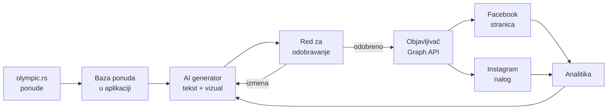
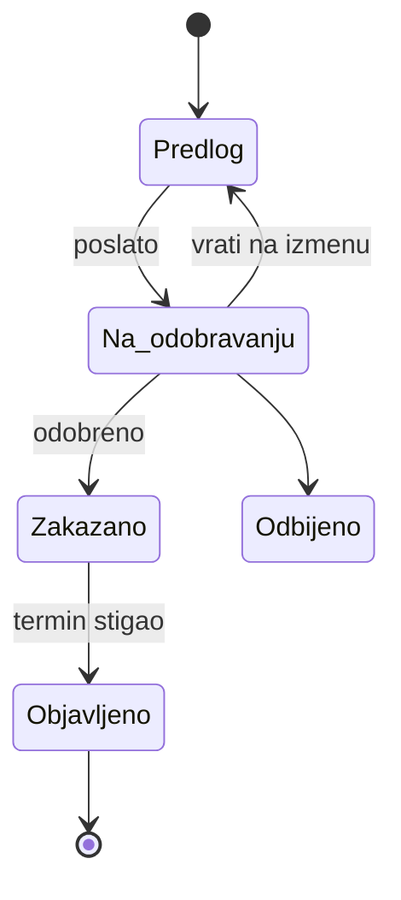

# Olympic Travel — aplikacija za automatizaciju objava

2026-09-21 · @Someone

## Cilj i obim

Cilj je interna web aplikacija za Olympic Travel koja od aktuelne ponude pravi gotovu objavu za Facebook i Instagram, a zaposleni je samo pregleda i odobri.

U obimu:

- Generisanje teksta objave i hashtagova na osnovu podataka o ponudi (destinacija, hotel, termin, cena, popust)
- Priprema vizuala: izbor postojeće fotografije uz automatsko dodavanje cene i logotipa, ili AI generisani vizual
- Red za odobravanje — nijedna objava ne ide javno bez potvrde čoveka
- Zakazivanje i objavljivanje na Facebook stranicu i Instagram nalog preko Meta Graph API-ja
- Kalendar objava i osnovna analitika po objavi

Van obima u prvoj verziji:

- Odgovaranje na poruke i komentare (ostaje u Meta Business Suite)
- Plaćene kampanje i budžeti (ostaje u Ads Manager-u)
- TikTok, YouTube i druge mreže

## Kako proces izgleda danas

Sve se radi ručno u Meta Business Suite — objava po objava, po nalogu. U Planneru se za septembar 2026 vide pojedinačne objave tipa „Ohrid… šarmantna destinacija“ (19.9), „Doživite čaroliju zime na Staroj Planini“ (17.9) i „Septembar na moru“ (18.9), svaka napravljena zasebno.

Koraci koji se ponavljaju za svaku objavu:

1. Neko u agenciji nađe aktuelnu ponudu i prepiše cenu, termin i hotel
2. Napiše tekst i hashtagove, najčešće po sećanju na prošlu sličnu objavu
3. Pronađe fotografiju i po potrebi je obradi
4. Otvori Create → Post, izabere stranicu i Instagram nalog, nalepi tekst, doda link
5. Objavi ili zakaže, pa isto ponovi za sledeću destinaciju

Tri posledice ovog načina rada:

- Vreme: 15–30 minuta po objavi, što praktično ograničava broj objava nedeljno
- Neujednačen ton i format — zavisi ko je tog dana pisao
- Rizik greške u ceni ili terminu, jer se podaci prekucavaju umesto da se povlače iz sistema

## Predložena arhitektura

Jedna web aplikacija sa četiri sloja: izvor ponuda, AI generator, red za odobravanje i objavljivač ka Meta API-ju. Sve živi na vašem serveru, bez zavisnosti od treće alatke tipa Buffer.

Svaki sloj se može menjati nezavisno: ako sutra promenite sajt ili dodate TikTok, dira se samo krajnji sloj.

| Sloj | Šta radi | Tehnologija |
| --- | --- | --- |
| Izvor ponuda | Povlači aktuelne aranžmane, cene i slike sa olympic.rs | WordPress REST API ili direktan izvoz iz booking sistema |
| AI generator | Piše tekst, hashtagove i priprema vizual | Claude API + biblioteka šablona |
| Odobravanje | Prikaz predloga, izmene, potvrda | Web panel sa nalozima za zaposlene |
| Objavljivač | Šalje na FB i IG, vodi računa o limitima | Meta Graph API, red poslova sa ponovnim pokušajima |

## Tok rada od ponude do objave

Od izbora ponude do objavljenog posta na oba naloga — dva do tri minuta rada čoveka umesto dvadeset.

1. Zaposleni u panelu izabere ponudu iz liste aktuelnih, ili aplikacija sama predloži šta je vredno objave (nova ponuda, snižena cena, termin koji se bliži popunjenju)
2. Aplikacija povuče tačne podatke: hotel, destinacija, termin, cena po osobi, usluga, popust, link ka rezervaciji
3. AI napiše tri varijante teksta — kraću za Instagram, dužu za Facebook, i jednu sa naglaskom na cenu
4. Aplikacija pripremi vizual: fotografiju hotela sa sajta, sa dodatom cenom i logotipom u vašem formatu
5. Zaposleni izabere varijantu, ispravi šta hoće i klikne Odobri
6. Objava ide odmah ili u zakazani termin; šalje se posebno na Facebook stranicu i na Instagram nalog
7. Posle 48 sati aplikacija upiše rezultate objave (domašaj, klikovi, reakcije) uz tu ponudu

Ključno je da se cena i termin nikad ne kucaju ručno — dolaze iz istog izvora kao na sajtu, pa objava i stranica za rezervaciju ne mogu da se raziđu.

## AI sloj: tekst i vizual

AI ne izmišlja podatke — dobija tačne vrednosti iz baze i piše samo tekst oko njih. Cena, termin i naziv hotela ubacuju se u tekst programski, posle generisanja, tako da model nema priliku da ih promeni.

Za tekst se čuva biblioteka od 20–30 vaših najuspešnijih objava kao primer stila. Model dobija destinaciju, tip putovanja i tu biblioteku, pa piše u tonu koji je publika već navikla da vidi od Olympic Travel. Različiti šabloni za različite povode: nova ponuda, last minute, sniženje, sezonska najava, podsećanje na rok za prvu uplatu.

Za vizual postoje tri puta, po ceni i kvalitetu:

| Pristup | Kako radi | Kada koristiti |
| --- | --- | --- |
| Šablon nad fotografijom | Postojeća fotografija hotela sa sajta, preko nje cena, termin i logotip u fiksnom dizajnu | Standardne ponude — najbrže i najjeftinije |
| Ručni izbor iz biblioteke | Zaposleni bira iz vašeg arhiva fotografija po destinaciji | Kada ponuda zaslužuje posebnu sliku |
| AI generisan vizual | Model pravi sliku po opisu destinacije | Opšte sezonske objave bez konkretnog hotela |

Preporuka je prvi pristup kao podrazumevani. AI generisane fotografije destinacija su rizične za turizam — gost koji prepozna da hotel ne izgleda tako gubi poverenje, a Meta od 2024. označava AI sadržaj oznakom koja u prodajnom kontekstu ne pomaže.

## Integracija sa Meta API-jem

Objavljivanje ide preko [Meta Graph API-ja](https://developers.facebook.com/docs/pages-api/posts), odvojeno za Facebook stranicu i Instagram nalog. Vaš Instagram nalog mora biti profesionalni i povezan sa Facebook stranicom — što već jeste, jer vam oba idu kroz isti Business Suite nalog.

Razlike koje određuju kako se piše objavljivač:

|  | Facebook stranica | Instagram |
| --- | --- | --- |
| Objavljivanje | Jedan poziv na `/page_id/feed` ili `/photos` | Dva koraka: kreiranje kontejnera, pa `media_publish` |
| Zakazivanje kroz API | Podržano, od 10 minuta do 30 dana unapred | Nije podržano — aplikacija mora sama da čuva raspored i objavi u tom trenutku |
| Slike | Više formata, upload fajla ili URL | Samo JPEG, i to sa javno dostupnog URL-a |
| Dnevni limit | Praktično nije ograničavajući | [100 objava u 24 sata](https://developers.facebook.com/docs/instagram-platform/content-publishing) po nalogu |
| Link u objavi | Klikabilan link u tekstu | Link ne radi u opisu — ide u bio ili kroz Stories |

Potrebne dozvole aplikacije: `pages_manage_posts`, `pages_read_engagement` za Facebook, i `instagram_business_content_publish` sa `instagram_business_basic` za Instagram.

Tri stvari koje se lako previde:

- **App Review.** Meta aplikacija mora proći proveru pre nego što dobije ove dozvole u produkciji. To znači snimak ekrana toka, opis upotrebe i čekanje od nekoliko dana do dve nedelje. Računajte na to u planu.
- **Page Publishing Authorization.** Ako je uključena na stranici, objavljivanje preko API-ja ne radi dok se ne završi verifikacija. Bolje proveriti unapred nego otkriti na dan puštanja.
- **Istek tokena.** Page access token treba obnavljati; aplikacija mora da prati istek i da javi kada je potrebna nova prijava, inače objave tiše prestanu da izlaze.

## Izvor podataka o ponudama

Sajt olympic.rs radi na WordPress-u sa zasebnim booking sistemom — linkovi ka rezervaciji nose parametre `objectGroupId`, `unitId`, `pricelistId` i datume, što znači da cene i raspoloživost dolaze iz tog sistema, ne iz WordPress-a.

Tri moguća izvora, po redu poželjnosti:

1. **Direktan pristup booking sistemu.** Ako sistem ima API ili izvoz, aplikacija povlači ponude, cene i slobodne termine tačno onako kako ih vidi sajt. Ovo je jedino rešenje kod kojeg objava ne može da prikaže cenu koja više ne važi.
2. **WordPress REST API.** Ako su ponude i hoteli upisani kao sadržaj u WordPress-u, dobija se opis, fotografije i link, ali ne nužno živa cena.
3. **Ručni unos u panelu.** Zaposleni ukuca destinaciju, hotel, termin i cenu — aplikacija i dalje piše tekst i pravi vizual. Radi od prvog dana, bez ikakve integracije.

Predlog je da prva verzija krene sa trećom opcijom, a da se prva doda čim se utvrdi šta booking sistem nudi. Tako aplikacija počinje da štedi vreme odmah, a ne čeka integraciju.

Za ovo je potrebno znati koji booking sistem koristite i da li NeoLab, koji održava sajt, ima pristup njegovoj dokumentaciji.

## Odobravanje i kalendar

Nijedna objava ne ide javno bez potvrde čoveka. To nije tehničko ograničenje nego svesna odluka: greška u ceni ili terminu na javnoj stranici košta više nego što potpuna automatizacija donosi.

Stanja kroz koja objava prolazi:

Dve uloge su dovoljne. Operater pravi predloge i šalje ih na odobravanje; odobravač potvrđuje i zakazuje. Ako neko ima obe uloge, objavljuje u jednom koraku — korisno za last minute ponude gde čekanje nema smisla.

Kalendar pokazuje sve zakazano po danima, sa filterom po mreži i destinaciji. Cilj je da se vidi ravnomernost — da ne ode pet objava o Grčkoj u istoj nedelji dok zimovanje stoji.

Korisna dopuna: ponavljajući planovi. Na primer, svakog ponedeljka predlog za „ponuda nedelje“ i svakog petka za vikend putovanja — aplikacija ujutru pripremi predlog, a čovek samo potvrdi.

## Analitika i učenje iz rezultata

Ovo je deo koji Meta Business Suite ne može da vam da: vezu između objave i onoga što se posle nje dogodilo u prodaji.

Aplikacija za svaku objavu čuva koja je ponuda u pitanju i kako je tekst napisan, pa uz to dopisuje rezultate iz Insights API-ja — domašaj, interakcije, klikove na link. Kada se linku ka rezervaciji doda oznaka kampanje, u statistici sajta se vidi i koliko je rezervacija došlo baš sa te objave.

Posle nekoliko meseci to daje odgovore koje sada niko nema:

- Koje destinacije nose domašaj, a koje rezervacije — nije uvek isto
- Da li objave sa cenom u vizualu rade bolje od onih bez
- Koji dani i termini najbolje prolaze kod vaše publike
- Koji ton teksta daje više klikova

Ti podaci se vraćaju AI generatoru kao smernica — uspešne objave ulaze u biblioteku primera, slabe ispadaju. Sistem s vremenom piše bolje, jer uči na vašoj publici, ne na opštim pravilima marketinga.

## Faze implementacije

Predlog je četiri faze, gde svaka sama po sebi nešto donosi. Ako se stane posle druge, sistem je i dalje upotrebljiv.

| Faza | Šta se dobija | Zavisnosti |
| --- | --- | --- |
| 1. Generator teksta | Panel gde se unese ponuda i dobiju tri varijante teksta sa hashtagovima; kopira se ručno u Business Suite | Nema — može odmah |
| 2. Objavljivanje kroz API | Odobrena objava ide direktno na FB i IG iz aplikacije, bez Business Suite-a | Meta aplikacija i App Review |
| 3. Povezivanje sa ponudama | Ponude, cene i slike se povlače sa sajta; nestaje prekucavanje | Pristup booking sistemu ili WordPress-u |
| 4. Analitika i učenje | Rezultati po objavi, veza sa rezervacijama, biblioteka uspešnih primera | Faza 2 i oznake kampanje na linkovima |

Faza 2 je na kritičnom putu zbog App Review-a — prijava se podnosi što ranije, jer čekanje na Metu teče paralelno sa razvojem, a ne posle njega.

Generisanje vizuala sa cenom i logotipom može ući u fazu 1 ili 3, zavisno od toga koliko vam je važno da slike budu ujednačene od početka.

## Rizici i troškovi

Najveći rizik nije tehnički nego sadržajni: objava sa pogrešnom cenom je javna i deli se dalje. Zato je obavezno odobravanje čoveka i povlačenje cene iz sistema umesto kucanja.

| Rizik | Kako se ublažava |
| --- | --- |
| Pogrešna cena ili termin u objavi | Podaci iz izvora, nikad ručno; odobravanje pre objave |
| App Review odbijen ili odugovlači | Prijava odmah na početku; faza 1 radi i bez njega |
| Meta menja API ili dozvole | Objavljivač izolovan u jedan sloj; promene diraju samo njega |
| Tekstovi počnu da zvuče isto | Više šablona po povodu; biblioteka primera se osvežava |
| Token istekne, objave stanu | Praćenje isteka i obaveštenje pre nego što se desi |
| Zaposleni zaobiđu panel i objave ručno | Panel mora biti brži od Business Suite-a, inače sistem neće zaživeti |

Troškovi u radu su mali. Meta API se ne naplaćuje. AI generisanje teksta za oko 60 objava mesečno je red veličine nekoliko evra, jer su objave kratke. Hosting aplikacije može na server na kojem je već sajt. Glavni trošak je razvoj, jednokratno.

## Sledeći koraci

Dve stvari blokiraju početak, a obe se rešavaju pitanjem, ne razvojem.

- [ ] Utvrditi koji booking sistem stoji iza rezervacija na olympic.rs i da li ima API — pitanje za NeoLab
- [ ] Proveriti da li je na Facebook stranici uključena Page Publishing Authorization
- [ ] Odlučiti ko u agenciji odobrava objave i koliko ljudi treba da ima pristup panelu
- [ ] Prikupiti 20–30 dosadašnjih objava koje smatrate najuspešnijim, kao osnovu za stil
- [ ] Otvoriti Meta aplikaciju i podneti App Review za dozvole za objavljivanje

Paralelno sa ovim može da krene faza 1 — generator teksta ne zavisi ni od čega sa ove liste.

## Izvori

- [Instagram Platform — Content Publishing](https://developers.facebook.com/docs/instagram-platform/content-publishing)
- [Pages API — Posts](https://developers.facebook.com/docs/pages-api/posts)
- [olympic.rs](https://www.olympic.rs/)
